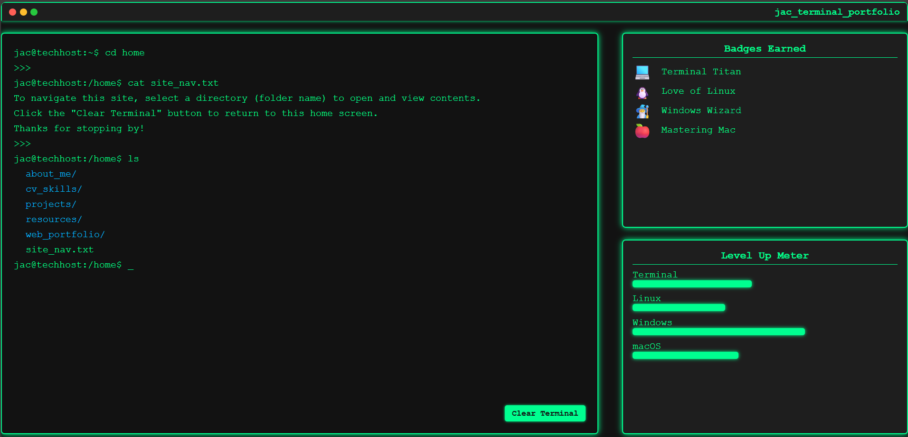

# web_portfolio_2.0
Create a personal web portfolio from scratch.

---

## Jac Terminal Portfolio (web_portfolio_2.0)
A terminal-themed tech support portfolio that includes:   
- Self-Created ASCII Art "JAC" logo
- Level-up meter showing skill progress
- Terminal-style navigation through About, Skills, Projects, and Resources.
- Clear Terminal Button and Window Panel (Terminal UI Feel)
- Linux, Windows, and repair badges (removed-- for now. May add back in later.)

---

## 🛠 Technologies
- HTML
- CSS 
- JavaScript



---

## Development Journey
- Just a creative project idea that I wanted to test out.
---

### Phase 1: The Start
1. **Setup Project Directory**
   - Created project folder: `index.html`, `style.css`, `script.js`, and `README.md`.  

2. **Created Custom ASCII Art Logo**
   - Designed “JAC Terminal” ASCII logo in Notepad.
   - Added as part of the UI using a `<pre>` block for proper formatting.

3. **HTML: Initial Framework**
   - Built base layout for the terminal UI container (`#terminalWrapper`).  
   - Added `#panelWrapper` with three panel boxes:
     - **ASCII Art Logo**
     - **Level-Up Meter**
     - **Badges Earned** (removed-- for now. Create a cleaner UI).

4. **CSS: Initial Styling**
   - Applied dark theme background (`#121212`) and neon green text (`#00ff90`).  
   - Added glowing borders and box shadows for retro terminal feel.  
   - Styled panel boxes for consistent sizing and alignment.

5. **Terminal Header UI**
   - Added fake macOS-style window buttons (🔴 🟡 🟢).
   - Inserted a terminal title: `jac_terminal_portfolio`.
   - Styled header and buttons to match the terminal aesthetic.

6. **Developed Popup Viewer**
   - **HTML**: Created popup structure to mimic opening a file or document.  
   - **CSS**: Styled the popup for “nano editor” and browser preview modes.  
   - **JS**: Added basic functions to show/hide popup when clicking items.  

---

### Phase 2: Interactions
1. **“Clear Terminal” Button**
   - **HTML**: Added button below the terminal container.  
   - **CSS**: Styled button to match terminal theme with hover/focus effects.  
   - **JS**: Added event listener to clear session and reload terminal:  
     ```js
     clearButton.addEventListener('click', () => {
       sessionStorage.clear();
       location.reload();
     });
     ```

2. **Directory Structure & Navigation**
   - **JS**: Created `directoryStructure` object to store folders and files.  
   - Added clickable folders:
     ```
     about_me/  cv_skills/  projects/  resources/  web_portfolio/
     ```
   - Used `bindDirectoryClicks()` to handle folder clicks dynamically.  

3. **Populated Folder Content**
   - **JS**: Added text files and project logs for each folder (e.g., `about_me.txt`, `vm_config.txt`).  
   - Dynamically loaded content into popup viewer when clicked.  

4. **Interactive Typing Effect**
   - Wrote `typeLines()` and `typeCharacters()` functions to simulate typing animation.  
   - Added blinking cursor animation using CSS:
     ```css
     .cursor {
       animation: blink 1s steps(2, start) infinite;
     }
     ```

5. **Boot-Up Sequence**
   - **JS**: Built `playBootSequence()` function to display animated startup messages.  
   - Used `sessionStorage` to skip boot on page refresh.  

---

### Phase 3: Refinement & Polish
1. **CSS Enhancements**
   - Improved responsiveness for smaller screens.  
   - Fine-tuned colors, spacing, and font sizes for consistency.  

2. **Content Creation**
   - Wrote detailed resource files:  
     - OS comparisons  
     - CMD/PowerShell cheat sheets  
     - Linux commands
   - Added level-up meters showing skill progress.  
   - Designed badges (💻 Terminal Titan, 🐧 Love of Linux, 🧙‍♂️ Windows Wizard). (removed-- for now).

3. **Popup Viewer Polish**
   - Styled modal headers with sticky titles and close buttons.
   - Added browser preview mode for `web_portfolio.html`.

---

## Features
- Retro terminal UI with boot sequence and blinking cursor.  
- Clickable directories and files for navigation.  
- Popup viewer with `nano` and browser preview modes.  
- Badges and level-up meters to gamify skills.
- “Clear Terminal” button to restart session.  
- ASCII Logo easter egg. Click the ASCII art to locate.

--- 

---

## About Me
Hi, I’m Justin Curtis. I am a tech-nerd, and I have an absolute passion for creating, building and tinkering. Taking an idea and bring it to life. jac_terminal_portfolio is just a result of my own curiosity and fun.

- JAC