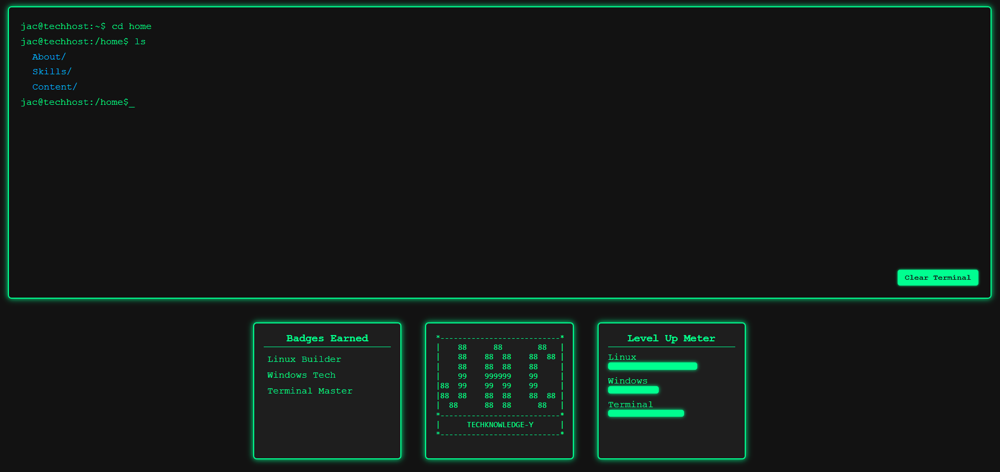

# web_portfolio_2.0
Create a personal web portfolio from scratch.

## Jac Terminal Portfolio (web_portfolio_2.0)
A terminal-themed tech support portfolio that includes:
- Linux, Windows, and repair badges
- Level-up meter showing skill progress
- Terminal-style navigation through About, Skills, Projects, and Repairs
Work In Progress!

1. Start outlining the web build project using this README file.
2. Start building the boiler plate for out html file.
3. HTML: Setup the boiler plate and the outline of the Terminal UI. 
4. CSS: Create the initial styles for the Terminal UI.
5. JS: Add the interactive components to make each directory (fake folders/files).
------------------------------------------------------
6. HTML: Refine the div containers for each box (Terminal UI, Badges Earned, and Level Up Meter).
7. CSS: Create the secondary styles for the Panel-Row (Badges Earned, and Level Up Meter).
8. Create my own neofetch-style logo for my Terminal UI (JAC Techknowledge-y).
9. HTML: Add another div container for the neofetch-style logo with its own box to place in the panel row. 
10. CSS: Create additional styles for the Panel-Row (Badges Earned, Neofetch Logo, and Level Up Meter).
------------------------------------------------------